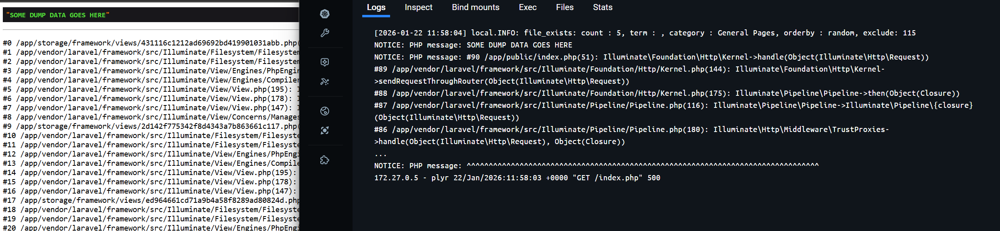
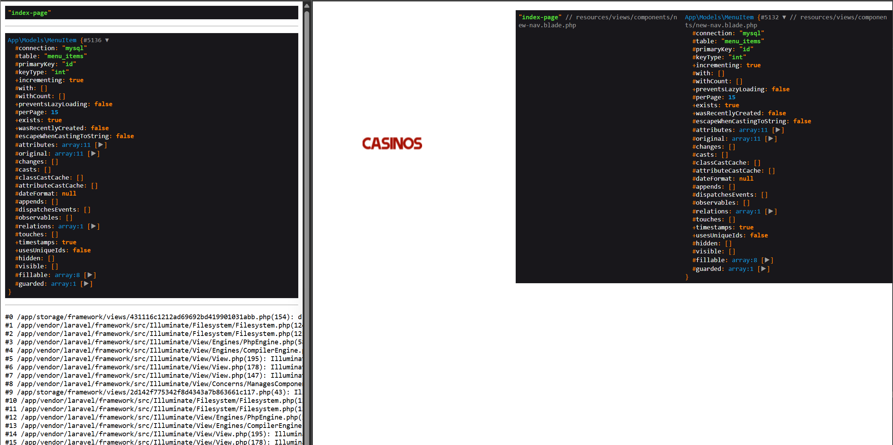

# symfony-php-dumper

The package provides a simple dump `d($yourFirstVar, $yourSecondVar,..);` function, based on the Symfony VarDumper package, to output the variables and stop execution. The output happens to the browser and console at the same time.

## Motivation

* To have an output to both the browser and CLI (like Docker logs) at the same time.
* To have a stack trace to be able to find where I have left the `d()` function.
* To ignore `d()` on production and staging environments. So if the function is still there in the code, it would not affect the runtime.
* To have a compact debug output, not affected by any HTML or CSS.

